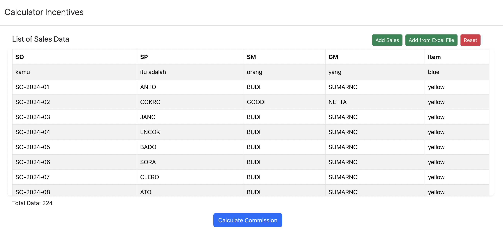
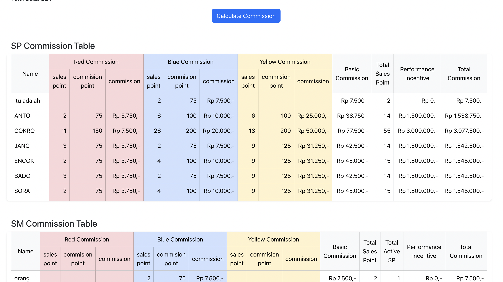

# Commission Calculator

This is an app for calculating commission

## Requirements

To run this project you need to have the following installed:

1. [Python](https://www.python.org/) version 3.9.6
2. [NPM](https://www.npmjs.com/) version 8.18.0

## Libraries

This application using following libraries:

1. [FastAPI](https://fastapi.tiangolo.com/) for backend side rest API
2. [Vue.JS](https://cli.vuejs.org/) for frontend side

## Run

Initiate application / install dependencies
```
make prepare
```

Run application
```
make run
```

Or with docker-compose
```
docker-compose up
```

The application should be running on http://localhost:8000

To see the API documentation: http://localhost:8000/docs

## Test
```
make test
```

## Screenshoot


